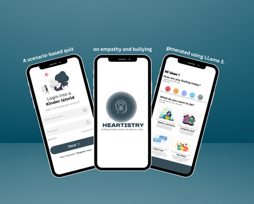

# ❤️‍🔥 Heartistry – AI-Powered Empathy Journal

> Developed under the **Universal Human Values (UHV)** initiative, Heartistry is an innovative, AI-powered empathy journal that leverages **LLaMA-3** to address bullying and foster emotional intelligence among students.

---

## 🌟 Overview

Heartistry blends **Artificial Intelligence** with **empathy education** to create a dynamic and personalized journaling platform for students. Using over 500 fine-tuned prompts and reflective exercises, Heartistry encourages students to explore real-world challenges and cultivate **empathy**, **self-awareness**, and **compassion**.

> 📚 *“Empathy isn’t taught—it’s experienced. Heartistry makes it real.”*

---
<p align="center">
  
</p>

## 🎯 Problems Addressed

- **Lack of Student Engagement**: Traditional programs fail to spark interest and relatability.
- **Rising Bullying Incidents**: Schools need stronger tools to build social resilience.
- **Gaps in Emotional Intelligence**: Most curricula overlook real-world emotional practice.

Heartistry fills these gaps by offering **scenario-based**, **AI-personalized**, and **ethically guided** journaling experiences.

---

## 💡 Features

- ✍️ **Reflective Journaling**: Thought-provoking, personalized questions based on students’ responses.
- 🎭 **Scenario-Based Learning**: Real-life simulations of complex social interactions.
- 🧠 **Emotional Intelligence Builder**: Exercises that promote self-awareness and empathy.
- 🪞 **Interactive Feedback**: Dynamic suggestions to deepen student introspection.
- 🧬 **Personalization Engine**: LLaMA-3 adapts to each student’s emotional journey.

---

## 🔧 Tech Stack

- **Frontend**: React / Flutter (based on your platform)
- **Backend**: Python (FastAPI / Flask)
- **AI Model**: Meta’s [LLaMA-3](https://ai.meta.com/llama/)
- **Database**: MongoDB / Firebase (for student journaling data)
- **Deployment**: Render / Vercel / AWS / Hugging Face Spaces

---

## 🧠 Role of LLaMA-3

Heartistry harnesses LLaMA-3 to:

- 📖 Generate **realistic, diverse social scenarios**.
- 🧩 Personalize exercises for **each student’s context**.
- 🔍 Facilitate **reflective journaling** through natural conversation.

---

## 🌍 SDGs Aligned

Heartistry directly contributes to:

- **SDG 4: Quality Education**
- **SDG 10: Reduced Inequalities**
- **SDG 3: Good Health & Well-Being**

---

## 🛡️ Responsible AI & Ethics

- 🔐 **Data Privacy First** – No sensitive student data is stored without encryption and consent.
- ⚖️ **Bias Mitigation** – Content is curated and reviewed by educators and ethicists.
- 🧪 **Feedback Loops** – Continual improvement based on teacher and student input.

---

## 🚀 Getting Started

### 1. Clone the Repository
```bash
git clone https://github.com/hahaanisha/Heartistry.git
cd Heartistry
```

### 2. Install Dependencies
```bash
pip install -r requirements.txt
```

### 3. Run the App
```bash
python app.py
# or use uvicorn for FastAPI
uvicorn app:app --reload
```

> **Note**: For React/Flutter frontend setup, refer to the respective `/frontend/README.md`.

---

## 📦 Folder Structure

```
heartistry/
│
├── backend/           # FastAPI/Flask backend with LLaMA-3 integration
├── frontend/          # Flutter or React-based UI
├── prompts/           # 500+ empathy-based fine-tuned prompts
├── data/              # Example journaling logs and analytics
├── docs/              # Project documentation and SDG mapping
└── README.md          # This file
```

---

## 📈 Future Roadmap

- [ ] Gamified empathy badges 🏅
- [ ] Teacher dashboard for emotional insights 📊
- [ ] Language support for regional inclusivity 🌐

---
## 📜 Achievement:

This project was ranked 1st prize in the project presentation competetion by CMPN dept at VESIT under GenAI category.

---

## 🧭 Final Note

Heartistry isn’t just a tech project—it's a **movement**. By empowering students with emotional insight and resilience, we’re not just reducing bullying—we're rewriting the social script of schools everywhere.

> *“Teach with tech, lead with love.”*
